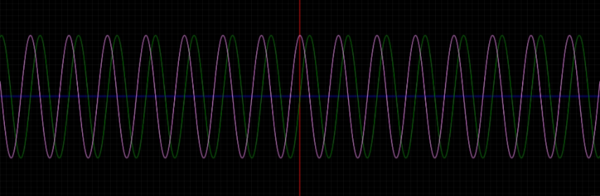

# CGraphJS

**Graph on your website !**

>
> CGraphJS is distributed under the [WTFPL](LICENSE).
>

---

## Documentation

See [CGraphJS Documentation](doc/documentation.md)

## Contributing

The CGraphJS source code is located in the Git repository at [github.com/AntoineLandrieux/CGraphJS](https://github.com/AntoineLandrieux/CGraphJS/).
Contributions are most welcome by forking the repository and sending a pull request.

## Credit

See **[AUTHORS file](AUTHORS)**

**Contributors :**

